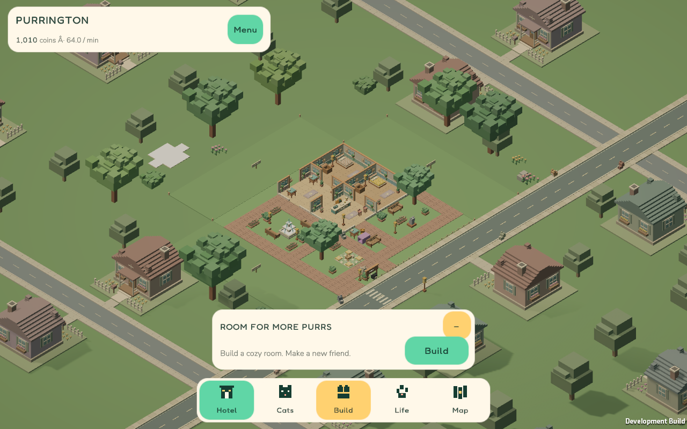
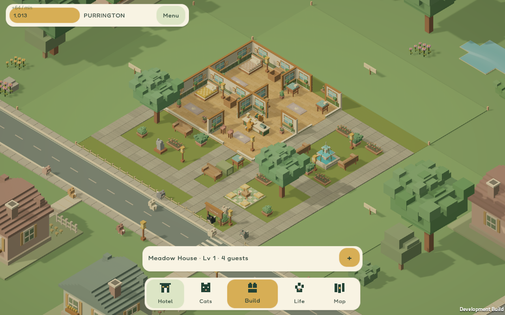
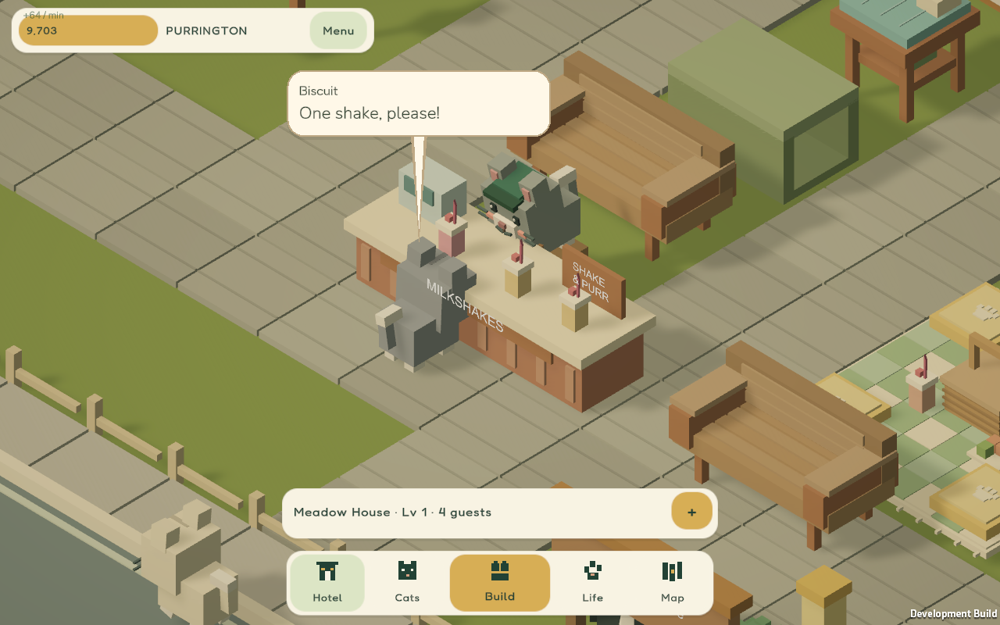
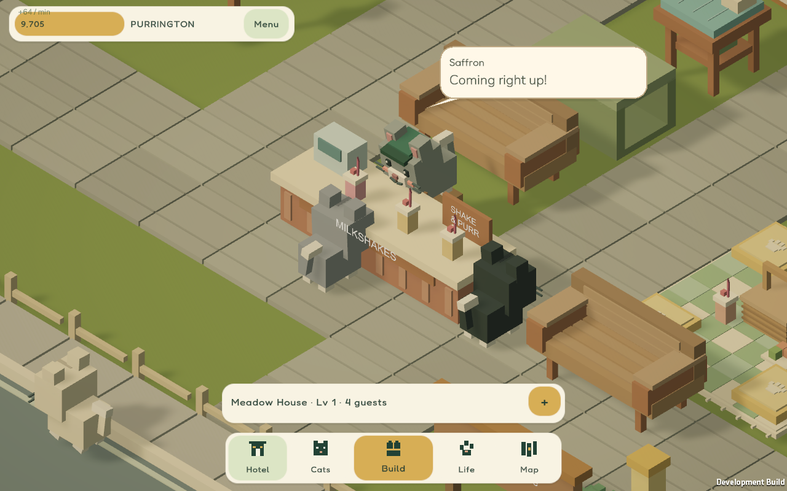
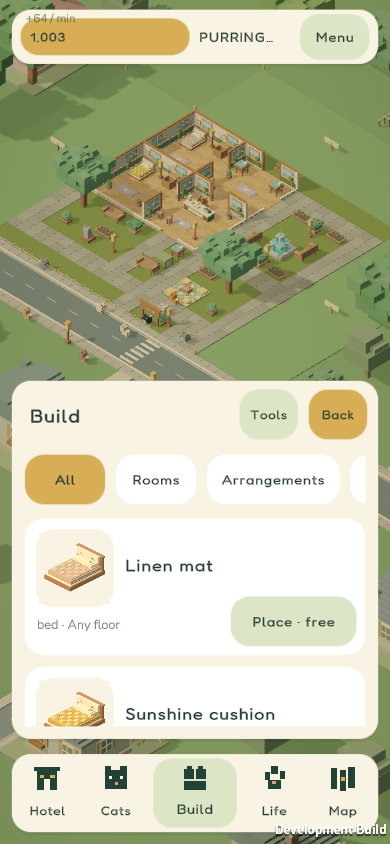
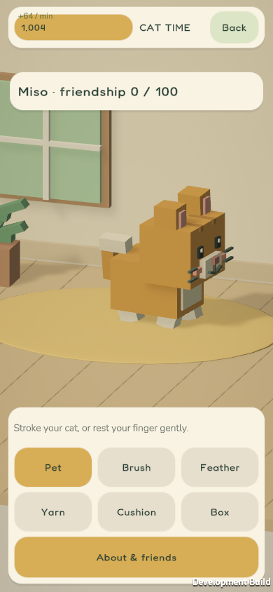

# Concept-inspired Meadow verification

The visual references are the original [hotel overview](../../../concept-art/02-hotel-overview.png) and [cat-world revision](../../../concept-art/06-cat-world-revision.png). This implementation interprets their cream plaster, warm timber, moss furnishings, terracotta accents, stone paths, golden daylight and cream/forest UI using the existing voxel geometry.

## Changes reviewed

- Counters previously selected a staff position and offered the other approach positions to customers, including the rear. Service now has explicit rotated front/rear positions; an inaccessible front closes service. Staff elevation follows the actual countertop and cat head geometry.
- Meadow now has ten street cats. Up to three transient visitors walk from the neighborhood, order a shake, drink and return. They reserve service positions, not hotel beds, and do not advance guest progression or income calculations. An accessible milkshake counter must exist; the starter hotel does not include one.
- One screen-space named speech bubble replaces floating text. Authored Godot conversations take priority over service remarks. Placement avoids the UI and nearby faces, hides unreadable/offscreen speakers, and respects text size and reduced motion.
- All 38 furnishings have actual-model previews, regenerated after the material changes. The catalogue opens on furniture, with rooms in the Rooms category and management actions under Tools. Storage shares the same previews.
- The larger care room supports roaming, resting and walking to toys/placements. Pet/brush input counts deliberate contact with the cat; toy and placement rewards wait for engagement. Assisted care is optional and defaults off. Completed interactions use the existing +3/+6 friendship transaction, cap and cooldown.
- The Windows build now includes its procedural water shader explicitly. A missing shader discovered in the standalone preview was fixed before delivery.

## Comparison captures

The baseline was captured from the existing Windows preview before this implementation. Its camera framing differs from the revised closer hotel fit.

| Original concept | Previous Windows preview | Revised Windows preview |
| --- | --- | --- |
|  |  |  |

| Front-of-counter order | Staff reply |
| --- | --- |
|  |  |

| Catalogue | Interactive care |
| --- | --- |
|  |  |

The [38-item contact sheet](../catalogue-concept-contact-sheet.png) shows complete furniture preview coverage.

## Verification results

- Unity EditMode: **69 passed**, zero failures/skips. Includes both counters in all four rotations, blocked/wall-adjacent fronts, occupied-counter movement/rotation/removal, visitor limits/departures, unchanged hotel capacity/economy, legacy saves, care cooldown/cap/rollback, gesture rejection and speech placement.
- Existing .NET domain suite: **675,892 checks passed**. Its dense 600-second simulation completed 209 visits and 18 cleanings with 18 guests in approximately 4.4 seconds of CPU time.
- Catalogue coverage: **38/38 imported sprites**, with visual inspection of the contact sheet.
- Windows build: succeeded with zero errors. The final incremental build has one informational warning that runtime Pipeline control is not configured; Editor integration remains available.
- Windows visual smoke: startup, camera, navigation, care, panel bounds, wheel zoom and saves passed, with 21 captures. Requested 360×640, 390×844, 430×932 and 1280×800 layouts are included.
- Windows pointer acceptance: **21/21 viewport/text-scale combinations passed**, zero failed checks and zero runtime errors. Queued mouse/touch events drive the actual Input System UI through catalogue scrolling, placement, navigation and care. Coverage includes 360×640, 360×800, 390×844, 430×932, 640×480, 800×760 and 1280×800 at 100%, 125% and 150% text. Care checks include valid/invalid gestures, delayed toy/placement rewards, off-cat input, second-pointer rejection, cancellation on tool changes, and Assisted care.
- Live visitor cycle: captured the customer order, staff reply, [drinking at a bench](visitor-drinking.png), and [departure](visitor-departing.png); one complete day visit finished in the final standalone run. The [cycle result](visitor-cycle.txt) records the observed states. Construction invalidates and safely recomputes in-progress entry/return routes.
- Performance: NVIDIA GeForce RTX 4090 Laptop GPU, 1280×800 development preview, starter Meadow, 180 frames over 3.00 seconds: **60.0 FPS average**, **16.9 ms worst sampled frame**, with a 60 FPS cap. This short steady-state sample excludes loading and does not establish performance on mobile hardware.

Final results are retained alongside the local Windows build in `builds/unity`. Tests and preview launches use isolated profiles, preserving the user's hotel saves. The uncommitted Unity package additions were preserved, and Godot remains separate.

Retained reports: [Unity tests](unity-tests.json), [pointer tests](pointer-tests.json), [Windows build](windows-build.json), [performance sample](performance.txt).

Physical Android/iOS device testing is still outstanding. Windows timing measures a capped development build on the test laptop, not mobile performance. The existing Android APK predates this update.
