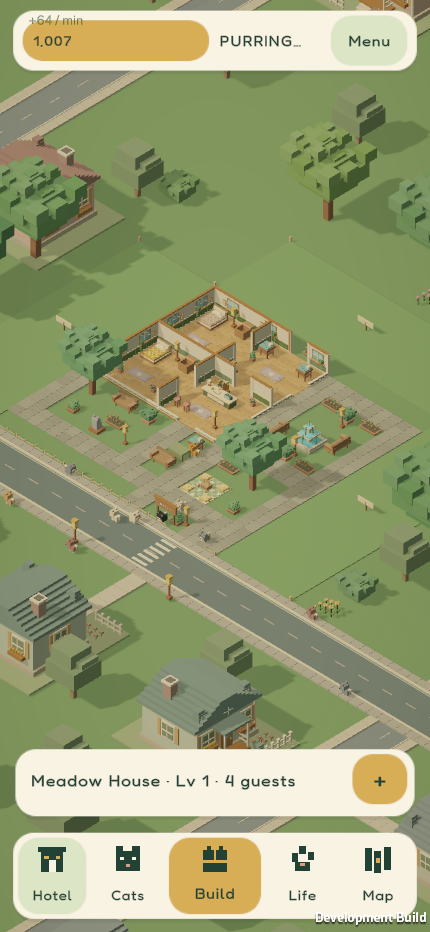
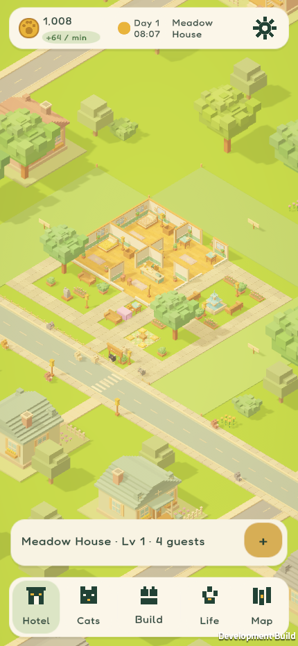

# Living color, Phase A: QA record

Captures come from `tools/unity.ps1 QA` on a Windows preview build (commit `9f6746d`). The lighting time is pinned with `WorldLighting.Pin`.

| | Before | After (noon) |
|---|---|---|
| 430×932 |  |  |

| Phase | Capture | Matches its reference? |
|---|---|---|
| Noon, 12:30 | `after/living-noon-430x932.png` | Mostly: bright lawn, pastel foliage, honey floors, soft shadows. Still a little hazy and low-contrast next to `assets/ui/mobile/welcome-hotel.png`. |
| Golden, 17:30 | `after/living-golden-430x932.png` | Yes: warm and golden. |
| Dusk, 19:30 | `after/living-dusk-430x932.png` | Yes: peach-lilac, as in `lantern-gathering.png`. |
| Night, 23:00 | `after/living-night-430x932.png` | Partly: windows and lamps glow (smoke check: 535 bright pixels, 0 before the fix), but the scene reads dim blue-grey rather than cozy. |

**HUD:** at 360×640 with 150% text, the header shows the balance, rate, "Day 1" and the time without truncation (`CheckHeader`).

**Performance** (Windows, Standalone; the Mobile quality tier is excluded on this platform): average 16.65–16.74 ms, capped at 60 FPS by vsync, for both baseline and after. The after run had a single 33 ms frame, which the review traced to a one-off warm-up hitch, not to per-frame work. Real mobile-tier timing needs an Android device run (see `docs/ANDROID-TESTING.md`).

**Tuning made during QA:**
- a pastel fallback rule for the 553 unmapped geometry colors
- lower daytime fill light
- a brighter night ambient
- glow multiplier raised to 3.2
