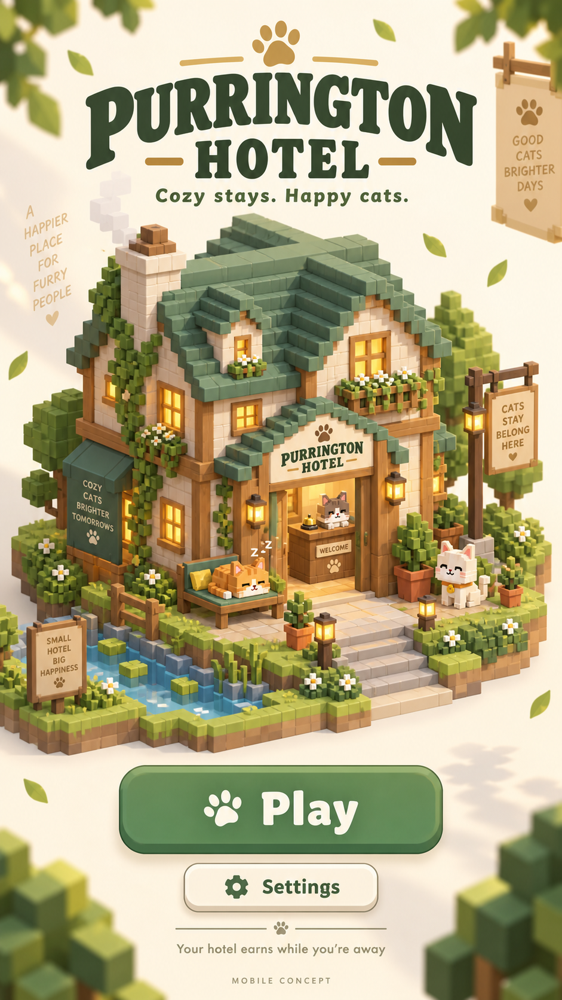
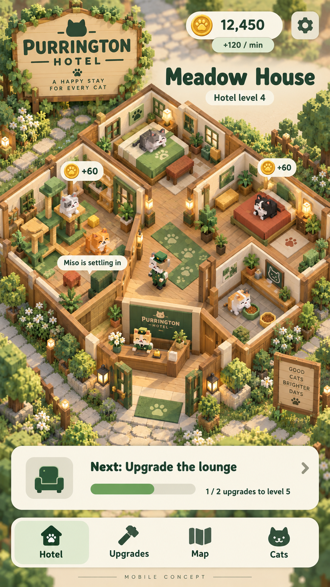
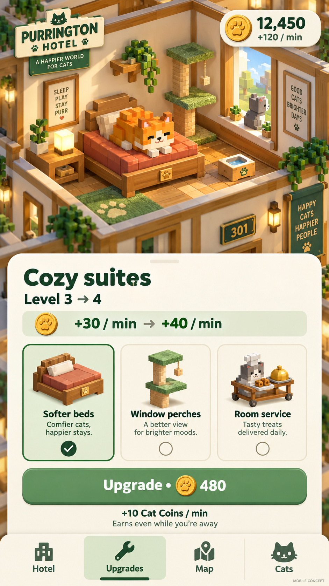
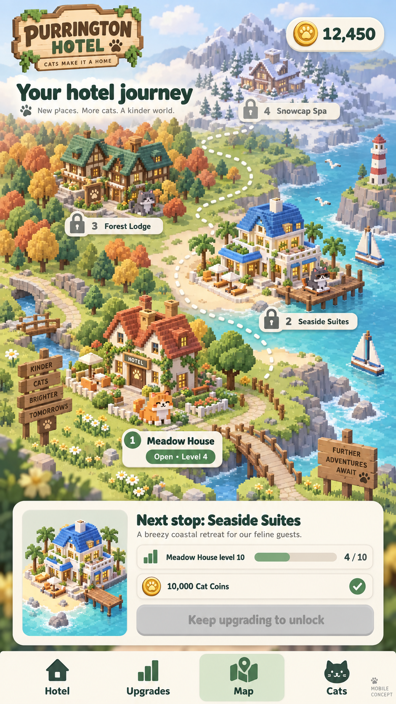
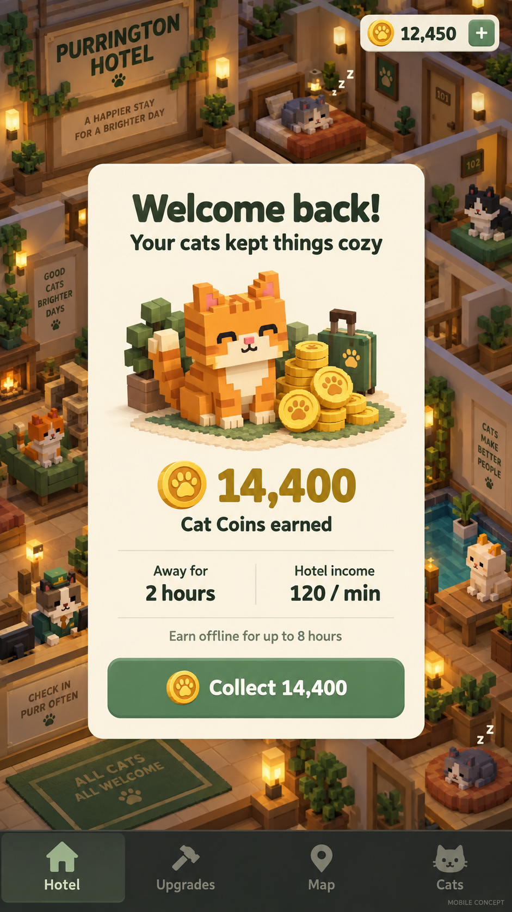
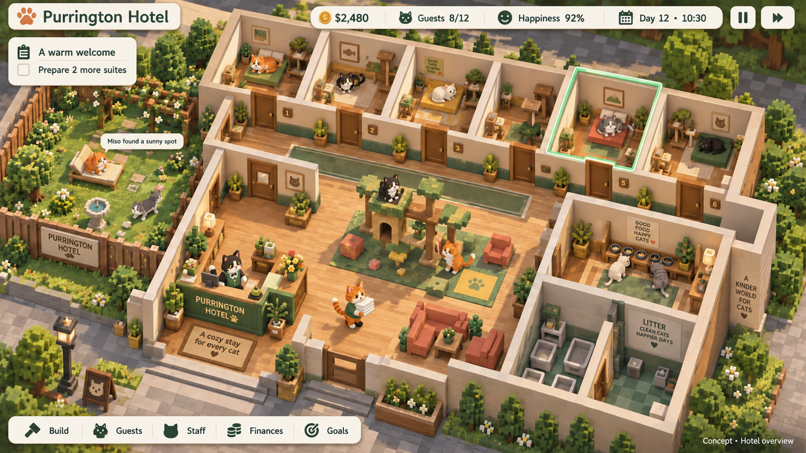

# Purrington Hotel — Mobile concept screenshots

Five portrait concept mockups for a mobile idle voxel cat hotel game. Generated using the built-in image generation tool. These depict visual direction, not a working game.

The core loop is **earn Cat Coins → upgrade → level up → unlock the next hotel**. Previous hotels keep earning, including while the player is away.

The world is inhabited and operated entirely by cats: guests, receptionists, attendants, and all background residents. Dogs, bunnies, and other animals are possible visitors for later-game events, outside the MVP.

| Screen | Purpose |
| --- | --- |
| [Main menu](01-main-menu.png) | Welcoming hotel vignette, Play, and Settings |
| [Hotel overview](02-hotel-overview.png) | Portrait isometric world, coin income, and next objective |
| [Upgrade menu](03-upgrade-menu.png) | Clear cost, income increase, and visible renovation |
| [Hotel map](04-hotel-map.png) | Meadow House → Seaside Suites → Forest Lodge → Snowcap Spa |
| [Offline earnings](05-offline-earnings.png) | Welcome-back summary and Cat Coin collection |

## Main menu

## Active hotel

## Upgrades

## Hotel journey

## Welcome back

## Review notes

The five screens are independent illustrative states. Exact levels and rates are not a validated single-save snapshot. The PRD defines economy behavior and release scope.

The generated art is intentionally rich; implementation should reduce incidental signage and detail for small-phone readability. Standardize navigation icons across screens. Present upgrade options as a progression track, add a visible dismiss control to the earnings sheet, and remove the incidental wallet plus icon unless a separately specified action needs it. Mark unreleased map locations “Coming later.”

The cat-only world rule supersedes incidental human-directed wording in earlier generated art. Replace slogans about “people” with cat-world language before production use. All worker models must have feline faces, paws, ears, and tails. The original desktop exploration's human workers were corrected in the separate character revision below; its landscape HUD remains historical and does not change the mobile idle direction.

Only Meadow House and Seaside Suites are in the proposed MVP; Forest Lodge and Snowcap Spa are expansion concepts. Offline income's eight-hour cap is a proposed balance value.

## Cat-world character revision

The user-marked landscape exploration now has a tuxedo cat receptionist, a tabby attendant, feline character icons, and cat-world signage. This is a targeted revision of that reference, not a change from the mobile idle product direction.

[Revision prompt](cat-world-revision-prompt.md)

[PRD](../PRD.md) • [Feature brainstorm](../FEATURE-BRAINSTORM.md) • [Exact prompts](prompts.md)
