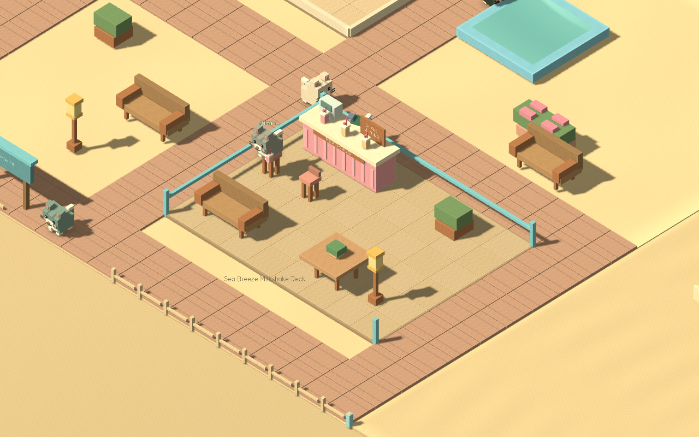

# Purrington — creative social hotel preview

The new hotel is a place to build, decorate and spend time with cats. It is now the default game for project Play and both Windows packages, with a separate save format from the original hotel.

## Play

Open `builds/windows/Play.cmd` or `builds/creative-social/Play Creative Hotel.cmd`. Both Windows ZIPs contain the current game. Keep the executable and resource pack together. In Godot, use project Play (F5); reopen the project if an existing editor still remembers the previous main scene.

Start in **Build**. The catalogue contains **Rooms, Shared spaces, Furniture, Outdoors, Storage and Land**. Choose a piece, position its preview in the world, then confirm the displayed price. Cancel only clears the preview. **Play** returns to the hotel immediately.

- **Land:** choose a marked adjacent parcel or select it in the catalogue. Each map has three parcels costing 750, 750 and 1,000 earned Cat Coins.
- **Rooms:** move, rotate, copy, resize or remove a room. Cottages use the same editable room system. Removal stores furnishings and refunds the paid shell; resizing previews anything moving to Storage.
- **Shared spaces:** place a furnished lobby, milkshake café, lounge, playroom, sunroom or terrace. Every piece remains individually editable.
- **Outdoors:** drag earth, gravel or brick paths; use the erase tool to remove a stroke. Add plants, trees, lights, benches, statues, fountains, fences, gates and the existing outdoor amenities.
- **Construction:** unfinished rooms remain saved. A guest room opens when its bed is reachable through constructed access to a working reception. Regular rooms support two guests; suites support four. Outdoor activities also allow grass access.
- **Hotel life:** arrivals check in, reserve activities and seats, order milkshakes, socialize and return to beds. Each counter has an automatic attendant. Housekeeping becomes available at level 3. Extra venues add capacity; hotel-wide service upgrades apply once per service family.
- **History:** Undo and Redo retain 20 build actions during the current session. Elapsed income and friendship survive Undo.
- **Camera:** drag to pan and use wheel or pinch to zoom. Focus frames the selection; Fit lot shows the full property.

Seaside retains its Meadow level 10 and 10,000-coin unlock. Forest, Snowcap and Cat Club use clearly labeled **preview test unlocks** with no real payment.

## God mode

Open **Settings → God mode** to unlock all maps, land parcels, cats and item requirements. Building, paths, service upgrades and staff changes are free while enabled, and the wallet reads **FREE**. Turning it off restores prices and keeps your creations and unlocks. Switching modes restarts Undo history. Free construction has no paid refund value, and placement and access rules still apply. The setting is saved; fresh games start with it off.

Actual enlarged-text captures: [Settings](god-mode/settings-360x640-150.png) and [Build](god-mode/build-360x640-150.png).

## Four destinations

| Map | Layout | Actual capture |
|---|---|---|
| Meadow House | Courtyard rooms, sunny shared room and garden paths | [Meadow](meadow.png) |
| Seaside Suites | Coastal promenade and outdoor milkshake terrace | [Seaside](seaside.png) |
| Forest Lodge | Woodland clusters, playroom and branching paths | [Forest](forest.png) |
| Snowcap Spa | Sheltered courtyard, warm lounge and pine scenery | [Snowcap](snowcap.png) |

## Interface review

Cream panels, mint actions, readable dark text and illustrated scene cards follow the Hotel / Build / Cat Care concept board. Mobile placement leaves at least half the safe screen height for the world; browsing leaves at least 35%. Desktop uses a side catalogue. Text supports 100%, 125% and 150%.

Actual captures cover **360×640, 360×800, 390×844, 430×932 and 1280×800**, each at 100% and 150% text, for browsing, placement, selection, room controls and expanded browsing. Additional captures show Hotel, Cats, Life, Map and Settings. Images are in `screenshots/`.

## Save isolation and recovery

The packaged project has both a creative default scene and a separate application identity. The launcher also selects a separate Windows profile. Opening the executable directly still starts the creative game and uses its own Godot user directory. Existing hotel saves are never read or converted.

Build changes save immediately through an alternating two-slot journal. Failed transactions restore wallet, ownership and layout together. Save errors remain visible with a retry action; closing after a failed save offers retry, continued play or an explicit exit without saving. If both existing journal slots cannot be read, they remain intact for recovery.

## Verification

See [verification.md](verification.md) for tested workflows, performance measurements and platform limits. The independent review and its fixes are recorded in [code-review.md](code-review.md).
