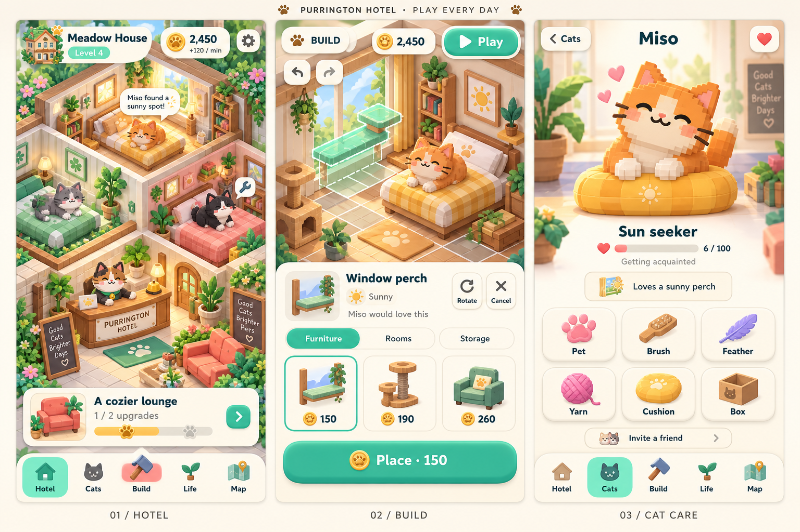
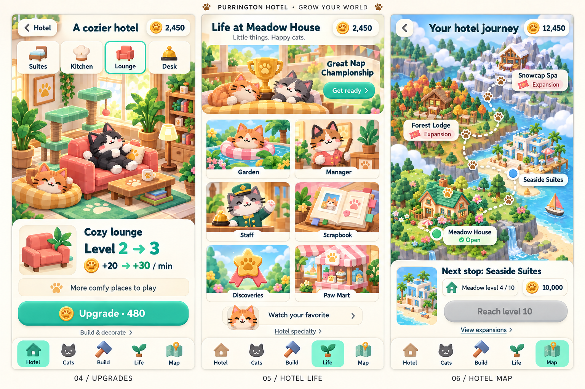
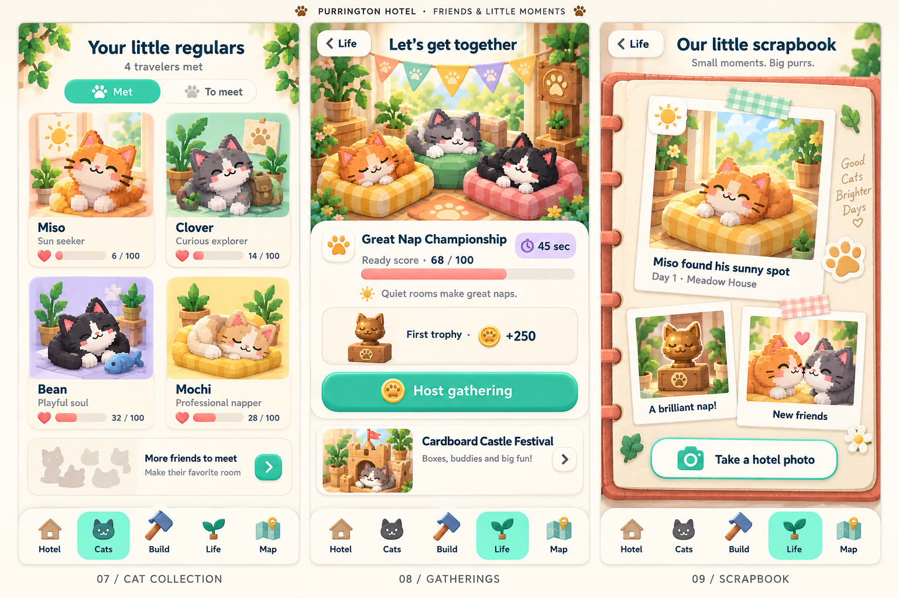
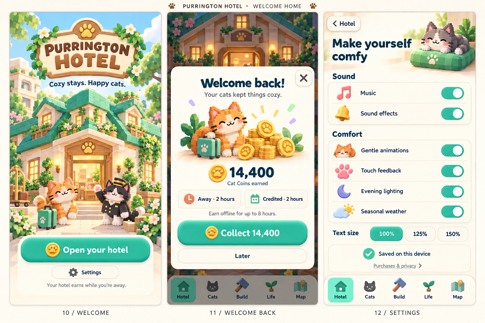
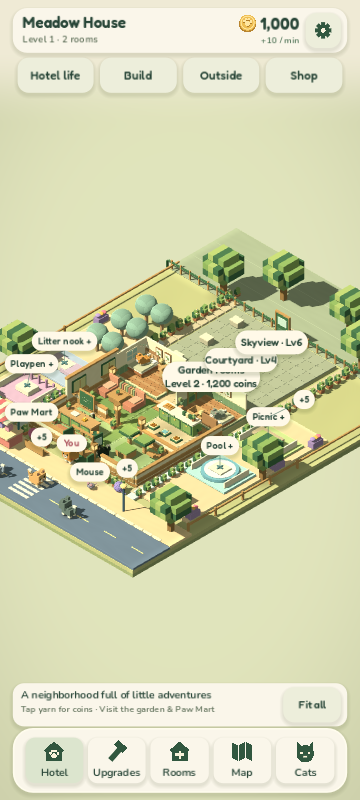
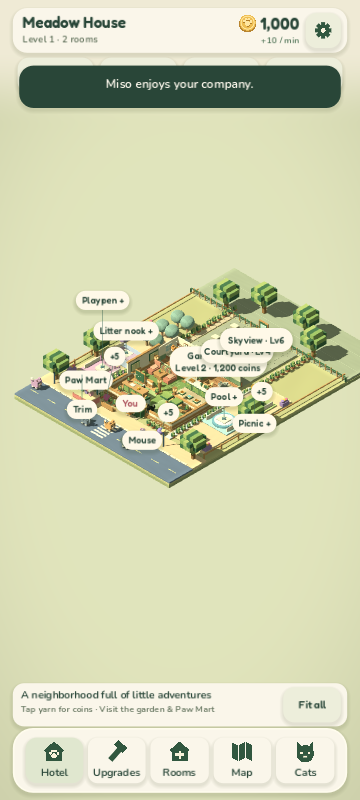

# Purrington Hotel · a more playful mobile game

Twelve new screen concepts across four coordinated boards, informed by the original artwork and the current running Godot game. The proposed direction keeps the cozy voxel cats and introduces brighter toy-like controls, larger character moments, illustrated activities and a simpler five-destination dock.

**Status:** Concepts and implementation plan ready for review. The game's source UI has not been changed.

[Design specification](../superpowers/specs/2026-09-13-playful-mobile-ui-design.md) · [Implementation plan](../superpowers/plans/2026-09-13-playful-mobile-ui.md) · [Exact generation prompts](prompts.md)

## Play every day

**Hotel:** bring the inhabited hotel closer, reduce competing labels, and show one useful next action.

**Build:** lead with illustrated furniture, collapse the catalogue during placement, and keep Play, Undo, Cancel and the real purchase price within reach.

**Cat care:** make the cat the hero, with six illustrated toy actions and clear friendship feedback.

[Open full-resolution board](01-hotel-build-cat-care.png)

## Grow your world

**Upgrades:** a visible room/service benefit, level progression and one clear purchase action.

**Hotel life:** six colorful activity tiles replace the long menu of similar text buttons.

**Map:** distinct destination scenes with clear earned-coin unlock and expansion states.

[Open full-resolution board](02-upgrades-life-map.png)

## Friends and little moments

**Cats:** collectible character cards with personality, friendship and discovery hints.

**Gatherings:** a playful event scene, readiness, duration and actual rewards.

**Scrapbook:** photos and memories feel like a little album rather than a list of records.

[Open full-resolution board](03-cats-events-scrapbook.png)

## Welcome home

**Welcome:** a warm cat-run hotel, one main Play action and Settings.

**Welcome back:** a satisfying reward moment with explicit Collect, Later and close controls.

**Settings:** friendly groups, large toggles, whole-app text sizing and truthful save status.

[Open full-resolution board](04-welcome-rewards-settings.png)

## What playing the current game revealed

The source game was run at 360×800 and 360×640 with isolated saves. Three rendered behavioral suites passed. An additional real-pointer-input walkthrough followed Play → Cats → Miso → Pet → Brush → Hotel → Build → Play → Hotel life; Miso reached 6 friendship. This is a scripted desktop-rendered playthrough, not a physical-phone usability study.

The most consequential finding is that returning through the Hotel tab resets the camera to the distant whole-property view. The initial hotel view also leaves substantial empty space, with many competing labels and small cats. Build and hotel-life content are available, but they require scanning dense controls before reaching the playful actions.

| Current game evidence | Proposed change |
| --- | --- |
| [Normal Play camera](current/00-normal-play-camera.png) | Frame bedrooms and reception, keeping cats recognizable |
| [Return from Cats](current/00-return-hotel-camera.png) | Preserve camera position and zoom when closing menus |
| [Build catalogue](current/00-build-catalogue.png) | Larger furniture cards and a shallower placement tray |
| [Hotel life](current/22-hotel-life.png) | Illustrated activity hub |
| [Cat care](current/20-petting.png) | Larger stage, clear toy buttons, separate invitations |
| [Map](current/04-map.png) | Distinct destinations with visible requirements |
| [Events](current/24-events.png) | Event illustration, preparation and progression |
| [Room copy at 360×640](current/build-blueprint-360x640.png) | Preserve immediate Paste, pricing and Cancel semantics |

### Current normal play and return view

## Implementation rules behind the concepts

- Five destinations: **Hotel, Cats, Build, Life, Map**. Existing features move into these destinations; none are intentionally removed.
- Use shared phone-unit sizing throughout the app. A logical Godot target can shrink below comfortable touch size on a phone; measure its actual displayed dimensions.
- Minimum 48×48 touch targets, 56-high primary actions, 16-unit body copy, reflow at 125% and 150%, safe-area-aware layout and explicit Back behavior.
- Keep existing Cat Coin prices, content IDs, transactions, saves and expansion ownership. Seaside still needs Meadow level 10 and 10,000 earned coins.
- Build still saves each Place immediately, refunds with Undo and exits immediately with Play.
- Preserve known/unknown cat preferences, staff training, specialty choices, events, discoveries, housekeeping, garden, Watch and the local album.
- Collect is the only reward-claim action. Later and close preserve pending earnings.

### Art review notes for production

These are generated visual concepts, not executable layouts or a single consistent save snapshot. The specification governs exact sizes and state behavior. Use native text, prices and icons over separately exported illustrations.

The final native UI should use dark pine text on mint buttons (the generated boards use white in places). Spec token contrast is approximately 4.94:1 for pine on mint and 9.59:1 for pine on cream. Small background signage should become simple paw emblems. The welcome button gets a paw/play icon, not the generated coin icon; hosting an event must not imply an invented fee. Furniture thumbnails and prices must be paired from the real catalogue; the first board's secondary thumbnails are illustrative. The 480 upgrade price is illustrative and must be replaced with the model quote. The concept world is more polished than current runtime art; the plan separates interface work from that additional art effort.

## Build order

1. Shared sizing/theme and whole-app text scale.
2. Five-destination navigation and reliable Back/scroll/focus.
3. Closer hotel camera and useful objectives.
4. Illustrated Build catalogue and placement.
5. Cats and care.
6. Hotel life and its activities.
7. Travel and expansions.
8. Welcome, rewards, upgrades and settings.
9. Phone-size matrix, physical-device validation and production art.

The [implementation plan](../superpowers/plans/2026-09-13-playful-mobile-ui.md) includes exact files, interfaces, code examples, behavioral checks and review checkpoints. Begin by reviewing the running result after steps 1–3.

## Provenance

Reviewed the six [original concepts](../concept-art/README.md), historical [prototype captures](../prototype-screenshots/README.md), later [building captures](../room-building-screenshots/README.md), and current code/gameplay. Fresh current-game images are preserved in `current/`.

Created all four new boards with the built-in image generation tool. Boards 2–4 use Board 1 as a style reference. Exact prompts are in [prompts.md](prompts.md). Final PNGs are saved in this folder; no deliverable depends on an image remaining in a temporary generation directory.
