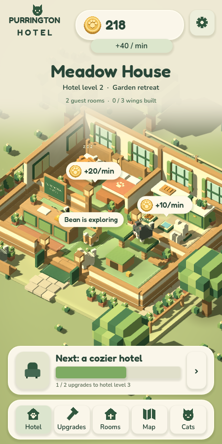
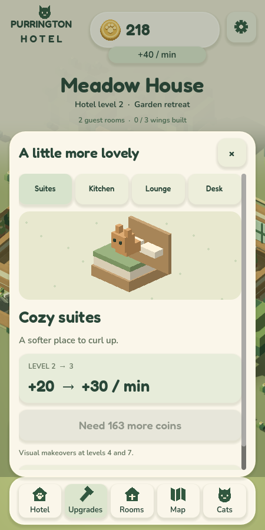
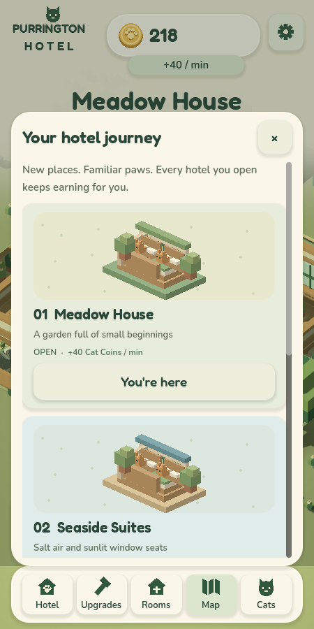
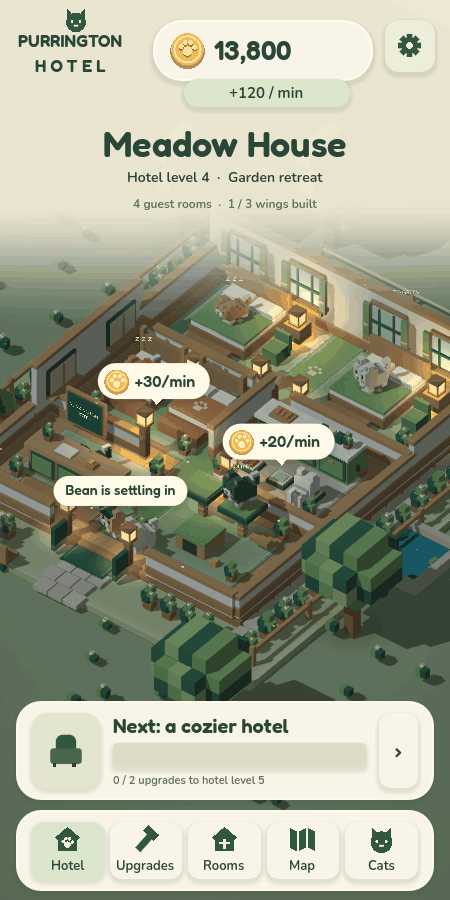

# Actual Godot prototype screenshots

Captured from the updated running Godot game at 450×900. Tests use separate local saves and advance state to exercise later screens. This visual pass adds detailed rooms, native shaders, cat routines, illustrated UI, and live income indicators. [Smaller phone capture (360×800)](phone-360x800/02-hotel.png).

| Screen | Capture |
| --- | --- |
| Title | [01-title.png](01-title.png) |
| Meadow House | [02-hotel.png](02-hotel.png) |
| Upgrade menu | [03-upgrades.png](03-upgrades.png) |
| Hotel map | [04-map.png](04-map.png) |
| Cat collection | [05-cats.png](05-cats.png) |
| Seaside Suites | [06-seaside.png](06-seaside.png) |
| Offline earnings | [07-offline.png](07-offline.png) |
| Settings | [08-settings.png](08-settings.png) |
| Room expansion | [09-rooms-menu.png](09-rooms-menu.png) |
| Expanded hotel | [10-expanded-hotel.png](10-expanded-hotel.png) |
| Evening lighting | [11-evening-hotel.png](11-evening-hotel.png) |
| All eight rooms | [12-full-hotel.png](12-full-hotel.png) |

## Actual game in motion

