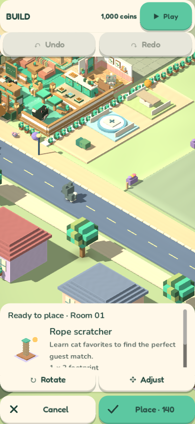
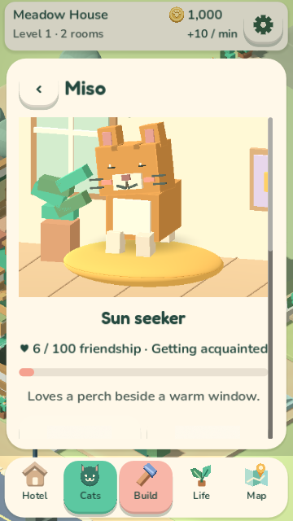
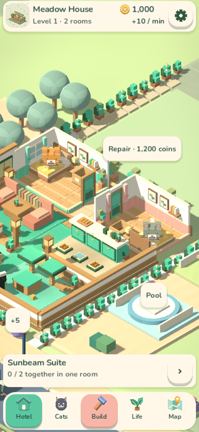

# Purrington Hotel: game improvement review

September 14, 2026 · Current local source, including existing uncommitted work

## Main recommendation

Make **learning about a cat, creating its favorite space, and seeing it enjoy that space** the central experience. The game already contains the mechanics to deliver this. The biggest opportunity is connecting them into a clear sequence with visible, personal rewards.

The strongest next release would improve the first ten minutes, room editing, and cat-specific progression. Those changes would make the existing content more rewarding to discover.

## What I reviewed

- Ran the existing fresh-save pointer walkthrough against current source at **390×844 and 360×640**. Both passed with zero failures. The walkthrough opens the hotel, meets and pets Miso, buys and places furniture, and visits Life, Map, and enlarged-text Settings.
- Inspected the resulting rendered screenshots and existing visual evidence.
- Read the economy, friendship, room-quality, gathering, objective, guest-routine, and navigation implementations.
- Ran isolated model experiments to verify costs, rewards, objective completion, and progression. These use disposable models and actual furnishing transactions.

This is a design assessment supported by automated interaction and source inspection, not an independent human playtest or a physical-phone test. The walkthrough pauses passive time after opening the hotel; it verifies actions, not natural session pacing. A Windows certificate-store diagnostic appeared, but both walkthroughs completed successfully. No gameplay source was changed.

## What already works

- **A coherent premise:** furnishing a welcoming hotel for recognizable cats is easy to understand and offers both creative and emotional rewards.
- **Real relationships between systems:** favorite furnishings affect guest scores; combinations affect income; happy visits build friendship and can introduce other cats.
- **A pleasant place to watch:** the warm voxel hotel, working staff, guest routines, garden amenities, doors, and construction provide activity beyond menus.
- **Forgiving creative tools:** immediate placement, refunds through Undo, storage, and room copying support experimentation.
- **Comfort options:** scalable text, reduced motion, sound settings, camera controls, and offline earnings are useful foundations.

## Priorities

| Order | Improvement | Why it matters | Relative scope |
|---|---|---|---|
| 1 | Keep the edited room clearly visible | Placement is a core action, and the current camera makes it difficult to judge | Small–medium |
| 2 | Build an actionable first-session sequence | Players need to understand how care, furnishing, and rewards connect | Medium |
| 3 | Make progression recognize the main activities | Decorating and friendship currently do not advance the hotel level | Medium |
| 4 | Give cats distinct requests and milestone rewards | Personal attachment can sustain interest after basic discovery | Medium–large |
| 5 | Make gathering preparation and repeat results matter | Current events provide little reason to improve or repeat the same result | Medium |
| 6 | Reduce scrolling and explain outcomes at the point of action | The most useful information is sometimes separated from the action it explains | Small–medium |

Scope estimates are comparative judgments, not delivery commitments.

## 1. Fix the build camera first

In both fresh walkthroughs, the settled placement view puts much of the hotel near or beyond the upper edge. Roads, gardens, and neighboring scenery occupy the center. The UI says the Rope scratcher is ready for Room 01, but that room and the small preview are difficult to inspect.

**Change:** when choosing a room or placing an item, center that room in the usable space between the controls and zoom close enough to distinguish the item, doorway, and floor cells. Keep an obvious room-focus control after manual panning. Make an optional compact catalogue leave more room for the scene.

**Success check:** a first-time player can select a furnishing, identify its preview, and place it accurately without first learning camera recovery. Verify this with tall and short phone layouts and enlarged text.

## 2. Turn the existing objective into a helpful guide

The starting objective is “Sunbeam Suite — 0 / 2 together in one room.” It opens Discoveries, where the player sees a clue. This asks the player to infer the relevant items, find them in Build, and connect them to Miso.

After completing the combination, the objective still returns **“Sunbeam Suite — 2 / 2 together in one room.”** The pinned combination takes precedence over later suggestions; completion does not advance it automatically.

**Change:** use a short, skippable sequence:

1. Meet Miso and pet him.
2. Learn that he likes sunny resting places.
3. Choose “Make Miso a sunny room,” opening the relevant furnishings.
4. Place the cushion and perch, with both the cost and benefit visible.
5. Invite or visibly welcome Miso to that room.
6. Show his reaction, the completed room combination, and a first memory.
7. Offer a choice: help another cat, improve a service, or prepare a gathering.

Keep each step actionable and recognize actions already completed. Advance completed suggestions, while allowing players to deliberately keep a favorite goal pinned.

Clear objectives and interactive, revisitable instruction are also recommended by [Microsoft’s objective-clarity guidance](https://learn.microsoft.com/en-us/xbox/accessibility/xbox-accessibility-guidelines/109). Here, the tutorial can be an actual guest request in the real hotel.

## 3. Connect decorating and caring to hotel progression

The controlled experiments show a split between the activities emphasized by the premise and the hotel-level gate:

| Fresh-game choice | Cost | Income afterward | Hotel level afterward |
|---|---:|---:|---:|
| Starting hotel | — | 10/min | 1 |
| Create one Sunbeam Suite | 270 | 21/min | 1 |
| Create Sunbeam Suite and Quiet Retreat in the two rooms | 560 total | 29/min | 1 |
| Open Kitchen and Lounge services | 480 total | 30/min | 2 |

Decorating has real value: Miso’s guest score rises **39 → 68** with the Sunbeam Suite, crossing the threshold for a happy visit. However, hotel level depends on service purchases alone: one level per two upgrades. Seaside requires level 10 and 10,000 coins. The cheapest sequence of 18 service upgrades costs another **7,187 coins**, before the destination purchase. This is a cost calculation, not a prediction of time to unlock.

**Change:** define one visible route through major hotel milestones, recognizing combinations, happy guests, gatherings, and service improvements. The existing star inspections could provide that structure. Business upgrades can still improve income, while the milestones recognize a broader picture of a successful hotel.

Show the next unlock and its concrete requirements close to the main objective. Validate the pace through full sessions before deciding whether prices should change.

## 4. Give the cats more individual substance

Names, traits, housing preferences, favorite actions, and habit memories already differentiate cats. Friendship milestones, however, share the same three descriptions and reward pattern. A favorite interaction awards six points every twelve seconds; **17 rewarded pets take Miso from 0 to 100 friendship in 192 simulated seconds** without increasing hotel level.

This creates a risk that the relationship feels finished very early, even though the hotel has much more progression ahead. It is not evidence that every player will optimize petting this way.

**Change:** add short requests and distinctive rewards to the existing cats. For example:

- Miso wants a sunny lookout, then brings a small sun-shaped keepsake.
- Clover wants a climbing route and later invites an adventurous friend.
- Bean wants a play space and shares a unique toy after a gathering.

Let later milestones unlock a recognizable behavior, furnishing variant, or small story moment. Give cat pairs a few distinct interactions and memories. Petting can remain freely enjoyable while richer milestones reflect shared experiences.

Also explain the interaction outcome: show friendship gained, a discovered favorite action, or a gentle indication that the cat is simply enjoying company. Currently an interaction during the twelve-second reward interval still succeeds and animates, but does not increase friendship.

## 5. Give gatherings a stronger payoff

Gatherings already have room-based preparation scores, temporary props, celebrations, and medals. Their result is calculated when the event starts. A first completion awards a trophy and 250 coins regardless of medal; the same-medal repeat produces no additional coin prize or new memory.

In the probe, a starting Nap Championship scores 30/100 and awards Bronze plus 250 coins. Repeating it adds only the normal **7.5 coins of passive income over 45 seconds**. Cardboard starts at 66/100 because the starting rooms already contain boxes.

**Change:** make preparation explain its ingredients: matching rooms, staff, happy guests, and the next medal threshold. Offer a direct route to the most useful preparation action. Give Silver and Gold distinct first-time rewards, such as a displayable trophy variant or themed furnishing.

For repeat play, vary a small guest request or room constraint and give a modest, clearly stated reward. During the gathering, have the relevant cats visibly use the themed space; a brief optional interaction could add personality. The player should understand what improved between one gathering and the next.

## 6. Put useful feedback beside the action

### Explain the total furnishing benefit

Build’s quality readout reports quality-derived income, while combinations and hotel-theme bonuses are calculated separately. The tested Sunbeam Suite has **quality 27 and quality income +0/min**, yet increases total hotel income by **11/min** through its combination and sunny theme bonus.

The qualifier is technically accurate, but the player has to assemble the benefit across screens.

**Change:** lead with a preview such as “Miso’s guest score: 39 → 68 · Hotel income: +11/min,” then allow players to expand the three room stats and bonus breakdown. Preserve the existing preference hints and build on them.

### Keep care actions visible on short screens

At 360×640, Miso’s portrait, trait, friendship, and preference fill the visible sheet; the toy buttons and gesture explanation are below the fold. Direct interaction with the portrait works, but its instruction appears after the toy grid and other actions.

**Change:** put “Pet or stroke Miso” beside the portrait and keep a compact strip of care actions visible. Preserve scrollable detail and large-text support.

### Make important hotel moments easy to revisit

The hotel already has check-ins, reviews, memories, and animations, but the latest review is housed in Discoveries and notices compete for brief attention. Add a small recent-guest card linking the guest, room, reaction, and reward. An away summary could mention who visited and what changed, alongside the coins.

The current offline simulation also caps guest summaries at eight per large advance. In the ten-minute experiment with a sunny room, active simulation recorded 12 visits and six happy visits; offline reconciliation recorded eight visits and three happy visits. Review whether that difference matches the intended value of returning later before promising equivalent relationship progress while away.

## Visual direction

The warm palette and isometric hotel are worth keeping. The main visual work should improve focus and readability: show the active cat or room clearly, reduce competing labels while editing, and reserve richer illustrations for moments where they support a decision or reward. The illustrated cards and live voxel cats use noticeably different levels of detail; closer consistency in silhouettes and cat identity would help.

## Recommended implementation sequence

**First pass — make the existing game easier to enjoy:** fix room framing; advance completed objectives; expose care instructions; show the full outcome of furnishings and interactions.

**Second pass — strengthen the central experience:** implement Miso’s complete welcome/request/room/reaction sequence and connect the hotel’s major unlocks to visible milestones. Test the sequence before extending it to more cats.

**Third pass — add lasting variety:** distinct cat requests and keepsakes, medal rewards, varied gathering goals, and better return summaries.

## How to validate the direction

Use a small first round of fresh players, including people comfortable with mobile games and people who rarely play. Treat these as proposed acceptance checks, not measured results:

- Within the first minute, players can explain what they want to do next.
- Within five minutes, they can complete a cat’s favorite room without coaching.
- They can point out the furnishing preview and explain the cost before placing it.
- After the first reward, they understand why that cat liked the room and what changed.
- After ten minutes, they can name a cat they care about and a next goal they chose.
- After returning later, they can resume their previous intention without searching through every menu.

Observe hesitation, camera corrections, menu backtracking, and whether players notice the cat’s reaction. Pair those observations with one question: **“What would you most like to do next?”**

## Evidence and source locations

- [Recorded model results](2026-09-14-game-review/systems-probe.json)
- [360×640 walkthrough log](2026-09-14-game-review/walkthrough-360x640.log)
- Fresh pointer flow: `tests/test_mobile_walkthrough.gd`
- Economy and unlocks: `scripts/core/hotel_model.gd`
- Guest scores, milestones, events, offline visit cap: `scripts/core/hotel_life.gd`
- Room quality: `scripts/core/room_quality.gd`
- Pinned objectives: `scripts/ui/mobile_ui.gd`, `next_action()`
- Build benefit display: `scripts/ui/build_panel.gd`, `scripts/ui/build_room_stats.gd`
- Care layout: `scripts/ui/views/cat_views.gd`
- Guest routines and gathering props: `scripts/world/hotel_world.gd`

The recommendation is based on these observed behaviors. Changes to enjoyment, retention, or session length remain hypotheses until tested with players.
