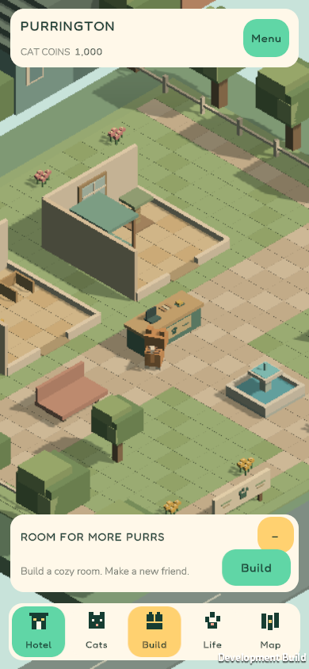
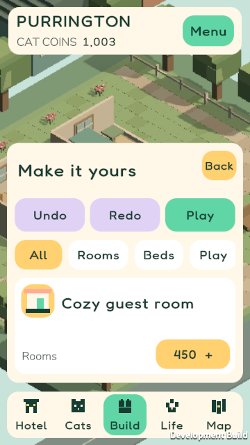

# Unity Meadow evidence

Captured from the Windows development preview on **Unity 6000.3.24f1 LTS**. These are actual runtime captures.

The programmatic smoke run reported: startup, orthographic camera, navigation, care stage, layouts, and save passed. It produced 18 screenshots without exceptions. The actions were invoked programmatically; this does not verify real pointer/touch input, the complete accessibility matrix, physical devices, or performance.

[Unity EditMode results](test-results.xml): **13 tests, 0 failures, 0 errors, 0 skips**. The separate standalone .NET harness reported 97 passing assertions; that result is distinct from this Unity test file.

## Representative captures

| View | Capture |
|---|---|
| Meadow hotel, 390×844 | [Hotel](01-hotel-390x844.png) |
| Catalogue, 390×844 | [Build](02-build-390x844.png) |
| Voxel cat care, 390×844 | [Care](04-care-390x844.png) |
| Catalogue, 360×640 at 150% text | [Enlarged text](09-build-360x640-150.png) |
| Desktop hotel | [Desktop](11-hotel-desktop.png) |

Full transient capture output remains under `builds/unity/captures`. An Android development APK build succeeded; no Android device or iOS verification is asserted here. The existing APK was built with 6.0 and predates the 6.3 zoom/layout update. Continue with the [QA checklist](../QA.md).
